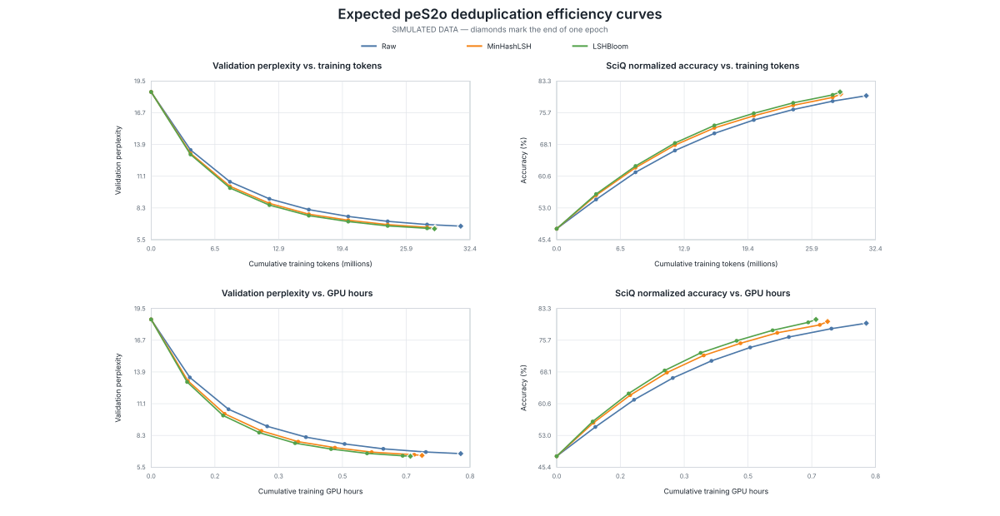

# LSHBloom Deduplication on peS2o

This repository evaluates how MinHashLSH and LSHBloom deduplication affect
continued pretraining on a 5,000-document peS2o sample. It contains the data
preparation code, reproducible Colab notebooks, validation helpers, and the
measured Qwen2.5-0.5B results.

## Headline result

For one epoch over each complete dataset, deduplication reduced both training
tokens and measured GPU time while retaining similar endpoint quality:

| Training data | Tokens | Token reduction | GPU hours | GPU-hour reduction | Final SciQ norm. | Full validation PPL |
| --- | ---: | ---: | ---: | ---: | ---: | ---: |
| Raw | 31,410,176 | — | 0.7167 | — | 84.2% | **11.4907** |
| MinHashLSH | 28,805,120 | 8.29% | 0.6573 | 8.28% | 84.1% | 11.5771 |
| LSHBloom | 28,751,872 | **8.46%** | 0.6560 | **8.47%** | **85.3%** | 11.5295 |

LSHBloom produced the strongest deduplicated endpoint in this run. This is a
single-seed pilot, and its PyTorch version differed from the other two runs, so
the result is evidence of comparable efficiency rather than a causal claim
that LSHBloom improves model quality. See the [complete Qwen result
assessment](reports/qwen/README.md) for the curves, controls, and limitations.

## Method

The source sample is transformed into three variants:

```text
5,000 peS2o documents
        |
        +-- Raw
        +-- MinHashLSH (Jaccard threshold 0.5)
        +-- LSHBloom  (Jaccard threshold 0.5)
                 |
                 +-- continued pretraining
                 +-- peS2o validation perplexity
                 +-- SciQ zero-shot accuracy
```

The deduplication configuration uses `datasketch==2.0.0`, 256 MinHash
permutations, seed 1, and an LSHBloom requested effective false-positive rate
of `1e-10`. Text is represented as a set of lowercased whitespace-token
unigrams.

The prepared sample contains:

| Variant | Documents | Documents removed | Available Qwen tokens |
| --- | ---: | ---: | ---: |
| Raw | 5,000 | 0 | 31,410,586 |
| MinHashLSH | 4,617 | 383 | 28,805,685 |
| LSHBloom | 4,611 | 389 | 28,752,978 |

MinHashLSH and LSHBloom agree on 4,994 of 5,000 retention decisions (99.88%).

## Installation

Python 3.10 or later is required. Create an isolated environment and install
the package with its local analysis and test tools:

```bash
python -m venv .venv
source .venv/bin/activate
python -m pip install --upgrade pip
python -m pip install -e ".[dev]"
```

The Colab notebooks install and pin their model-specific dependencies inside
the runtime.

## Repository map

| Path | Purpose |
| --- | --- |
| [`src/lshbloom_pes2o/`](src/lshbloom_pes2o/) | Reusable deduplication, token packing, evaluation, and validation code |
| [`scripts/data/`](scripts/data/) | peS2o variant preparation command |
| [`scripts/analysis/`](scripts/analysis/) | Result validation and static figure generation |
| [`scripts/notebooks/`](scripts/notebooks/) | Deterministic notebook builders |
| [`notebooks/qwen/`](notebooks/qwen/) | Qwen training and evaluation notebooks |
| [`notebooks/plamo/`](notebooks/plamo/) | PLaMo continued-pretraining notebook |
| [`reports/qwen/`](reports/qwen/) | Versioned Qwen tables, figures, and interpretation |
| [`tests/`](tests/) | Unit, notebook, and repository-structure tests |

## Prepare the data variants

The input must be a JSONL or JSONL.GZ file with a text field accepted by the
preparation library. This command creates Raw, MinHashLSH, and LSHBloom files
plus a manifest with counts and hashes:

```bash
python scripts/data/prepare_pes2o_variants.py \
  --input /path/to/pes2o-5000.jsonl.gz \
  --output-dir /path/to/processed \
  --expected-documents 5000
```

Use `--tokenizer Qwen/Qwen2.5-0.5B` when the environment also contains
Transformers and the manifest should include model-token counts.

## Qwen experiments

The [Qwen notebooks](notebooks/qwen/) cover four stages:

1. Validate base-model perplexity on a small peS2o sample.
2. Continue pretraining each variant with an equal 24,999,936-token budget.
3. Evaluate final checkpoints on all 1,000 examples in the SciQ test split.
4. Train for one full corpus epoch and compare quality against cumulative
   tokens and training GPU hours.

The controlled SciQ setup uses `lm-evaluation-harness==0.4.13`, zero-shot
evaluation, no chat template, and length-normalized accuracy as its primary
metric. Run each training variant in a fresh Colab runtime and keep the model
revision, software versions, seed, validation hashes, and hyperparameters
fixed.

To rebuild the committed notebooks after changing a builder:

```bash
for builder in scripts/notebooks/build_*_notebook.py; do
  python "$builder"
done
```

## PLaMo replication

The [PLaMo notebook](notebooks/plamo/) applies the same equal-compute protocol
to `pfnet/plamo-2-1b`. Its common budget is 24,883,200 tokens because that is
the largest complete 2,048-token sequence budget available to every variant
under the pinned PLaMo tokenizer.

Run it on an A100 with BF16 computation and FP32 model parameters. PLaMo uses
a model-specific optimizer and dependency set, so its absolute results should
not be treated as a controlled architecture comparison with Qwen.

## Results and figures

The [Qwen report](reports/qwen/README.md) contains both experiments:

- At the equal 24,999,936-token budget, validation perplexity differs by less
  than 0.04% from Raw for both deduplicated variants.
- At the one-epoch endpoints, MinHashLSH and LSHBloom use about 8.3% and 8.5%
  fewer tokens and GPU hours than Raw.
- Continued pretraining lowers base-model SciQ performance in all three runs,
  which suggests catastrophic forgetting, an aggressive training setup, or a
  corpus-to-task mismatch.

The following plot shows the expected direction using simulated values only;
the report contains the measured curves.



Rebuild all report tables and figures from the local source snapshots with:

```bash
python scripts/analysis/plot_qwen_results.py
python scripts/analysis/generate_expected_efficiency_plot.py
```

The run JSON snapshots are intentionally ignored because they include local
environment metadata. Derived CSV tables and publication-ready PNG, PDF, and
SVG figures are versioned.

## Local quality checks

Run the same checks used to maintain this repository:

```bash
ruff format --check src scripts tests
ruff check src scripts tests
pytest -q
```

Tests validate deduplication behavior, token accounting, experiment identity,
notebook contents, generated plots, repository layout, and local Markdown
links. No hosted CI configuration is included.

## Limitations

The current evidence comes from a 5,000-document pilot and one training seed.
The LSHBloom efficiency run used PyTorch `2.6.0+cu124`, while Raw and
MinHashLSH used `2.11.0+cu128`. A strict comparison requires rerunning all
variants in one pinned environment with at least three seeds. The repository
does not include a license, so public visibility does not grant reuse rights.
