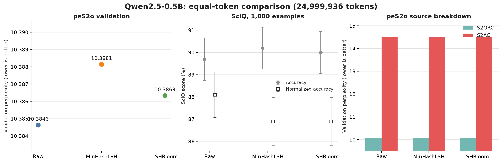
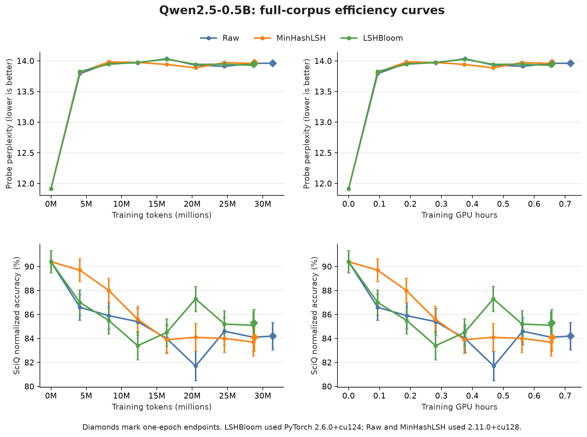

# Qwen2.5-0.5B result assessment

## Decision

The current evidence **partially matches** the expected deduplication result, but it is not sufficient to claim that deduplication improves model quality.

- MinHashLSH reduces the one-epoch budget by **8.29% of tokens** and **8.28% of measured training GPU hours**. LSHBloom reduces it by **8.46% of tokens** and **8.47% of GPU hours**.
- At the small-probe endpoints, LSHBloom has the lowest perplexity (13.9516) and the highest normalized SciQ accuracy (85.3%). Raw records 13.9613 and 84.2%; MinHashLSH records 13.9717 and 84.1%.
- On the larger final peS2o validation sample, Raw remains best. LSHBloom perplexity is **0.34% worse** than Raw (11.5295 versus 11.4907), while MinHashLSH is **0.75% worse** (11.5771).
- LSHBloom used PyTorch `2.6.0+cu124`; Raw and MinHashLSH used `2.11.0+cu128`. This is the only experiment-identity difference, but it prevents a strictly controlled three-way comparison.
- Every result currently uses seed 42. The experiment therefore does not measure variation between training runs.

The strongest conclusion supported by these runs is that both deduplication methods reduce this corpus and its one-epoch compute cost while retaining broadly similar endpoint quality. LSHBloom has the strongest deduplicated endpoint in this run, but the PyTorch mismatch and single seed mean that the difference cannot yet be attributed to the deduplication method.

## Equal-token experiment

All three variants used exactly 24,999,936 training tokens and the same training configuration. The validation document IDs and predicted-token counts match across variants.

| Variant | Validation PPL | Change from Raw | SciQ acc. | SciQ normalized acc. |
| --- | ---: | ---: | ---: | ---: |
| Raw | 10.3846 | — | 89.7% | 88.1% |
| MinHashLSH | 10.3881 | +0.0338% | 90.2% | 86.9% |
| LSHBloom | 10.3863 | +0.0164% | 90.0% | 86.9% |

The perplexity differences are tiny. SciQ gives mixed rankings: both deduplicated variants have slightly higher raw accuracy but lower normalized accuracy. Every difference is smaller than the combined standard error of the two estimates. With one training seed, these numbers do not identify a reliable winner.

## Full-corpus efficiency experiment

All three runs use the same model revision, source manifest, hyperparameters, training plan, validation probe hash, per-sequence probe hashes, SciQ revision, and final validation documents. Raw and MinHashLSH share experiment fingerprint `0be0a3b6f53bad7320d9e2dfb3b1900660b5712e95640bf8bb80919df3f0b010`. LSHBloom has fingerprint `1da70c1efb4e77d6e1cca30e380b32237c811e941658dc51181d243dfd457f35` because its PyTorch version differs.

| Variant | PyTorch | Training tokens | GPU hours | Probe PPL | SciQ acc. | SciQ norm. | Full validation PPL |
| --- | --- | ---: | ---: | ---: | ---: | ---: | ---: |
| Raw | 2.11.0+cu128 | 31,410,176 | 0.7167 | 13.9613 | 87.3% | 84.2% | 11.4907 |
| MinHashLSH | 2.11.0+cu128 | 28,805,120 | 0.6573 | 13.9717 | 86.9% | 84.1% | 11.5771 |
| LSHBloom | 2.6.0+cu124 | 28,751,872 | 0.6560 | 13.9516 | 88.1% | 85.3% | 11.5295 |

The curves show two different findings:

1. **Relative deduplication efficiency is plausible.** Both deduplicated variants finish earlier than Raw and remain near its endpoint. LSHBloom uses slightly fewer tokens and GPU hours than MinHashLSH and has a better endpoint on every reported quality metric in this run.
2. **The LSHBloom advantage is not yet causal evidence.** Its final SciQ normalized advantage over Raw is 1.1 percentage points, approximately one reported standard error, and its runtime differs. The curves are also noisy rather than consistently ordered.
3. **The absolute learning trend remains unfavorable.** The base checkpoint starts near probe perplexity 11.91 and SciQ normalized accuracy 90.4%. After continued pretraining, all variants move to roughly 14 perplexity and 84–85% normalized accuracy. The expected curve would preserve or improve those scores as training increases. This run instead shows degradation, consistent with catastrophic forgetting, an overly aggressive training setup, or a mismatch between the continued-pretraining corpus and the evaluation tasks.

The curve probe and the larger final validation use different sample sizes, so their absolute perplexities must not be compared directly. Comparisons are valid within one panel and evaluation set.

## What is needed next

1. Rerun LSHBloom with PyTorch `2.11.0+cu128`, or rerun every variant in one pinned software image, to restore a strict three-way control.
2. Repeat all variants with at least three seeds. Keep the data order, validation samples, optimizer settings, and checkpoint token positions controlled.
3. Lower the learning rate or add a short learning-rate sweep because all variants lose substantial base-model SciQ performance early in training.
4. Add a general-language validation set alongside peS2o and SciQ to distinguish domain learning from broad capability loss.
5. Predeclare an equivalence margin, such as a maximum acceptable perplexity increase and SciQ decrease, before interpreting the repeated runs.

## Files and provenance

- `fixed_token_summary.csv`: three-way 24,999,936-token results.
- `efficiency_curve.csv`: three-way checkpoint measurements.
- `efficiency_endpoint_summary.csv`: three-way one-epoch endpoint comparison.
- `plot_qwen_results.py`: validation and plotting script.
- `source/`: local input instructions plus the earlier SciQ comparison CSV supplied during this experiment. Full S3 JSON snapshots remain local because they contain run metadata.

The plots were generated from the saved source files. Error bars in the SciQ panels show one standard error.
