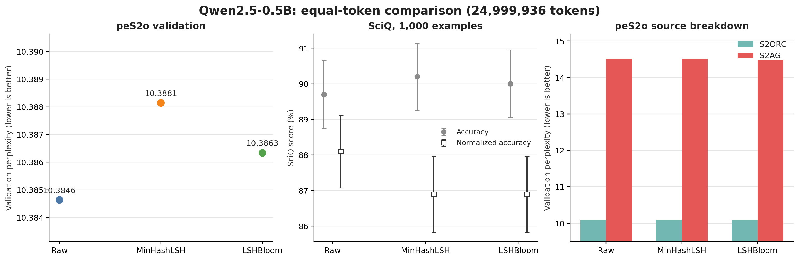
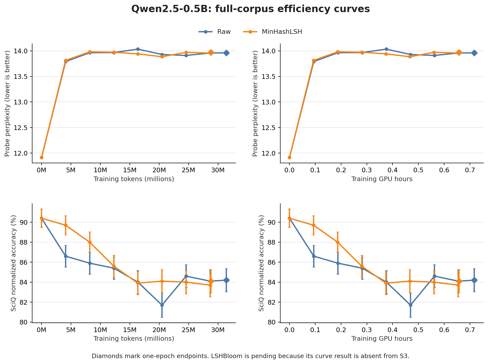

# Qwen2.5-0.5B result assessment

## Decision

The current evidence **partially matches** the expected deduplication result, but it is not sufficient to claim that deduplication improves model quality.

- MinHashLSH reduces the one-epoch training budget by about **8.29% of tokens** and **8.28% of measured training GPU hours**.
- At the endpoints of the small fixed curve probe, MinHashLSH is close to Raw: normalized SciQ accuracy is 84.1% versus 84.2%, and perplexity is 13.9717 versus 13.9613.
- On the larger final peS2o validation sample, MinHashLSH perplexity is **0.75% worse** than Raw (11.5771 versus 11.4907).
- LSHBloom does not yet have a full-corpus curve result in S3, so the main three-way efficiency comparison is incomplete.
- Every result currently uses seed 42. The experiment therefore does not measure variation between training runs.

The strongest conclusion supported by these runs is that MinHashLSH reduces this corpus and its one-epoch compute cost while producing a similar small-probe endpoint. The larger validation result does not show exact quality parity, and the experiment has not established statistical equivalence.

## Equal-token experiment

All three variants used exactly 24,999,936 training tokens and the same training configuration. The validation document IDs and predicted-token counts match across variants.

| Variant | Validation PPL | Change from Raw | SciQ acc. | SciQ normalized acc. |
| --- | ---: | ---: | ---: | ---: |
| Raw | 10.3846 | — | 89.7% | 88.1% |
| MinHashLSH | 10.3881 | +0.0338% | 90.2% | 86.9% |
| LSHBloom | 10.3863 | +0.0164% | 90.0% | 86.9% |

The perplexity differences are tiny. SciQ gives mixed rankings: both deduplicated variants have slightly higher raw accuracy but lower normalized accuracy. Every difference is smaller than the combined standard error of the two estimates. With one training seed, these numbers do not identify a reliable winner.

## Full-corpus efficiency experiment

Raw and MinHashLSH share the same experiment fingerprint (`0be0a3b6f53bad7320d9e2dfb3b1900660b5712e95640bf8bb80919df3f0b010`), validation probe hash, per-sequence probe hashes, and final validation documents.

| Variant | Training tokens | Training GPU hours | Final probe PPL | Final SciQ normalized acc. | Full validation PPL |
| --- | ---: | ---: | ---: | ---: | ---: |
| Raw | 31,410,176 | 0.7167 | 13.9613 | 84.2% | 11.4907 |
| MinHashLSH | 28,805,120 | 0.6573 | 13.9717 | 84.1% | 11.5771 |

The curves show two different findings:

1. **Relative deduplication efficiency is plausible.** At its earlier endpoint, MinHashLSH is close to the Raw endpoint on the small probe and SciQ while using about 8.3% less training.
2. **The absolute learning trend is unfavorable.** The base checkpoint starts at probe perplexity 11.9125 and SciQ normalized accuracy 90.4%. After continued pretraining, both variants move to roughly 14 perplexity and 84% normalized accuracy. The expected curve would preserve or improve those scores as training increases. This run instead shows degradation, consistent with catastrophic forgetting, an overly aggressive training setup, or a mismatch between the continued-pretraining corpus and the evaluation tasks.

The curve probe and the larger final validation use different sample sizes, so their absolute perplexities must not be compared directly. Comparisons are valid within one panel and evaluation set.

## What is needed next

1. Run the existing full-corpus notebook for LSHBloom to complete the three-way comparison.
2. Repeat all variants with at least three seeds. Keep the data order, validation samples, optimizer settings, and checkpoint token positions controlled.
3. Lower the learning rate or add a short learning-rate sweep because both completed variants lose substantial base-model SciQ performance immediately.
4. Add a general-language validation set alongside peS2o and SciQ to distinguish domain learning from broad capability loss.
5. Predeclare an equivalence margin, such as a maximum acceptable perplexity increase and SciQ decrease, before interpreting the repeated runs.

## Files and provenance

- `fixed_token_summary.csv`: three-way 24,999,936-token results.
- `efficiency_curve_partial.csv`: Raw and MinHashLSH checkpoint measurements.
- `efficiency_endpoint_summary_partial.csv`: one-epoch endpoint comparison.
- `plot_qwen_results.py`: validation and plotting script.
- `source/`: local input instructions plus the earlier SciQ comparison CSV supplied during this experiment. Full S3 JSON snapshots remain local because they contain run metadata.

The plots were generated from the saved source files. Error bars in the SciQ panels show one standard error.
